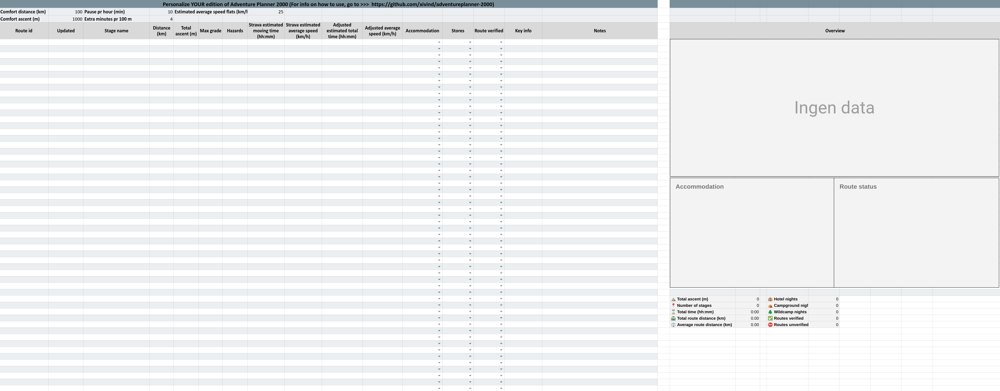

# Adventure Planner 2000 - the ultimate planning tool for bicycle touring

If you plan to roll as these gentlemen here[^1], spending weeks, or maybe months, on the road, some planning could really pay off. [Stravas route planner](https://www.strava.com/athlete/routes) certainly can be of big help, and the heatmaps are particularly useful. Still, it has some shortcomings, most notably the lacking ability to display an overview and basic statistics about select routes. Adventure Planner 2000 is finally here to fill that gap. 

## Configuring Adventure Planner 2000

Adventure Planner 2000 consists of two main parts; a Python-script and a Google Sheet. The Python-script reads route data from Strava. The same script then transforms relevant parts of the data and writes it to the Google sheet. The tourer will then further enrich the data by adding notes and so forth to the Google sheet. In sum, this will give the tourer a nice and confident-building overview of what lies ahead. The picture below shows an Archimate overview of how Adventure Planner 2000 works.

Before running the Python-script you will need to take care of a few things:
1. Clone this repo or download the three files `main.py, google_config.json, strava_routes.json`
2. Open the Workbook [Blu Acciaio Toolbox](https://docs.google.com/spreadsheets/d/1zl39qEc4gIZ-zMhTJqjIWqdtMvfMpQoQUzO8uS53CJA/edit?usp=sharing) and copy the sheet `Adventure Planner 2000 - Template`. Make sure you place the copy of the sheet in a workbook you have full access to, so you can give yourself editor access. You can name the worbook and sheet whatever you like, but take note of the workbook ID and sheet name. We will return to this in a few steps. 
3. The Python-script relies on a few libraries that are not installed by default, in particular `icecream` for debugging and `gspread` for easier use of the Google Sheets API.
4. The gspread library requires that you provide some info, that will be used to authenticate with Google. We found that Google service accounts is the easiest way to authenticate with Google. Authenticating this way also has the advantage that you only need to grant access to a specific workbook, i.e. the one you created in step 2, instead of your entire Google Drive. The process of setting up a Google service account and configure gspread is quite well explained in the [documentation](https://docs.gspread.org/en/latest/oauth2.html) og gspread. Note that you also need to enable API access for Google Sheets. It seems API access to Google Drive is not necessary if service account is used for authentication. 
5. Gspread also needs to know which workbook and sheet to work on. Provide this information by updating `google_config.json` with the id of your workbook and name of the sheet, according to step 1.
6. [Strava](https://www.strava.com) require all users of their API to authenticate, even though your routes may be public. The Python-script will handle the authentication with Strava, using oauth2, but needs four pieces of information: a client ID, a client secret, an access token and a refresh token. To get your hands on this information, follow [Stravas getting startet guide for developers](https://developers.strava.com/docs/getting-started/). Once you have the information, update `strava_tokens.json`.

The picture below shows the sheet from the Blu Acciaio Toolbox, which you must copy to your own workbook.

## Using Adventure Planner 2000
Once you have completed the steps above, your are ready to start planning! Just follow these steps:
1. Create some [routes in Strava](https://www.strava.com/athlete/routes). Take note of the route ID, e.g. 27711092. You find the route ID by looking at the URL, its the last part.
2. Enter the route IDs in column A of the sheet you copied. One route ID per row.
3. Run the Python-script, and make sure to provide `google_config.json` and `strava_tokens.json` as arguments, along with --debug. The command would typically look like this: `python3 main.py --debug no --secrets_file strava_tokens.json --config_file google_config.json` The debug option creates a lot of noise, and is only useful if you need to troubleshoot something.
4. Open up your Google sheet. It will now contain select route data from Strava in columns B-G. Columns H-K are computed automatically, based on data from Strava and the preferences set in B2-B3, D2-D3 and H2. We think these preference should match most tourers out there, but if you need to tweak estimates for time and average speed up or down, just change these values.
5. Finally, enrich your route data from Strava by adding data in columns L, M and P. When you have your route all dialed in, mark it as verified in column N. Column O will show you some key info about the rute, and there are also some stats all the way to the right in the sheet. If you change the routes in Strava later on, just run the Python-script again. It will lookup the right route IDs in the sheet and only replace relevant data from Strava and leave user added data unaltered.   

The picture below shows what kind of terminal output you can expect when runnint the Python-script 

The picture below shows how the sheet looks like after Strava data has been imported and enriched by the user (tourer)

## The road ahead
This is a beta version and we are still working on it, so let us know if you have ideas for improvements or are stuck somehow in getting it to work.
Reach out to us by creating an issue here at github, or by sending a few words to info@bluacciaio.com. We are probably out riding, but will get back to you as soon as we can!

[^1]: Early bike packers as Voss (photo: Axel Lindahl/Norsk Folkemuseum)